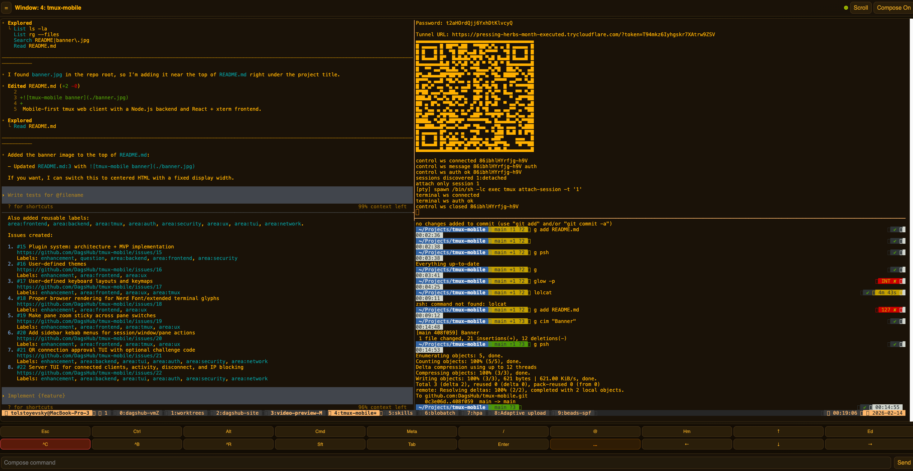
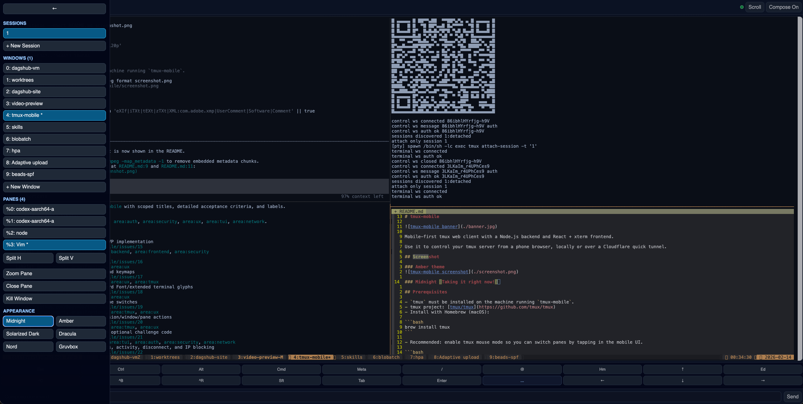

# Remux

**Remote tmux, anywhere.** A web-based tmux client that lets you monitor and control terminal sessions from any device — phone, tablet, or another computer.

Built for the age of AI coding agents: keep an eye on Claude Code, long-running builds, or any tmux workflow without being chained to your desk.

## Features

- **Web-based terminal access** — full tmux interaction through your browser, no app install needed
- **Mobile-first UI** — touch-optimized interface designed for phones and tablets
- **Secure remote access** — optional Cloudflare tunnel for access from anywhere, with password authentication enabled by default
- **Multi-client support** — each connected client gets independent window focus via grouped tmux sessions
- **Themes** — Amber and Midnight built-in themes
- **Zero tmux knowledge required** — tap-friendly interface, no commands to memorize

## Screenshots

### Amber theme


### Midnight theme


## Prerequisites

- **Node.js** 20 or newer
- **tmux** installed on the host machine

```bash
# macOS
brew install tmux

# Ubuntu / Debian
sudo apt install tmux
```

Recommended: enable mouse mode for tap-to-switch-pane in the mobile UI:

```bash
echo 'set -g mouse on' >> ~/.tmux.conf
tmux source-file ~/.tmux.conf
```

## Quick Start

### Run from source

```bash
git clone https://github.com/yaoshenwang/remux.git
cd remux
npm install
npm start
```

The CLI prints local and tunnel URLs — open on your phone to connect.

### CLI Options

```
remux [options]

Options:
  -p, --port <port>                Local port (default: 8767)
  --password <pass>                Authentication password (auto-generated if omitted)
  --[no-]require-password          Toggle password requirement (default: true)
  --no-tunnel                      Don't start Cloudflare tunnel
  --session <name>                 Default tmux session name (default: main)
  --scrollback <lines>             Scrollback capture lines (default: 1000)
  --debug-log <path>               Write backend debug logs to a file
```

### Environment Variables

| Variable | Description |
|----------|-------------|
| `TMUX_MOBILE_SOCKET_NAME` | Dedicated tmux socket name (`tmux -L`) for isolation |
| `TMUX_MOBILE_SOCKET_PATH` | Explicit tmux socket path (`tmux -S`) |
| `TMUX_MOBILE_DEBUG_LOG` | Enable debug log file output |
| `TMUX_MOBILE_FORCE_SCRIPT_PTY` | Force Unix `script(1)` PTY fallback |

## Security

- Password authentication enabled by default (random password generated if not specified)
- Clients attach through dedicated grouped tmux sessions for independent window focus
- Full security model documented in [SECURITY.md](./SECURITY.md)

## Development

```bash
# Start dev server (backend + frontend with hot reload)
npm run dev

# Quality gate
npm run typecheck
npm test
npm run test:e2e
npm run build

# Optional: real tmux smoke test
npm run test:smoke
```

## Tech Stack

- **Backend**: Node.js, Express, WebSocket (ws), node-pty
- **Frontend**: React 19, xterm.js, Vite
- **Testing**: Vitest (unit/integration), Playwright (E2E)
- **Language**: TypeScript

## Based On

Remux is based on [tmux-mobile](https://github.com/DagsHub/tmux-mobile) by [DagsHub](https://github.com/DagsHub), a mobile-first tmux web client. We build upon their excellent foundation to add further customizations and features tailored to our workflow. The original project is also inspired by [porterminal](https://github.com/lyehe/porterminal).

Thank you to the DagsHub team for creating and open-sourcing tmux-mobile under the MIT license.

## License

MIT — see [LICENSE](./LICENSE) for details.
