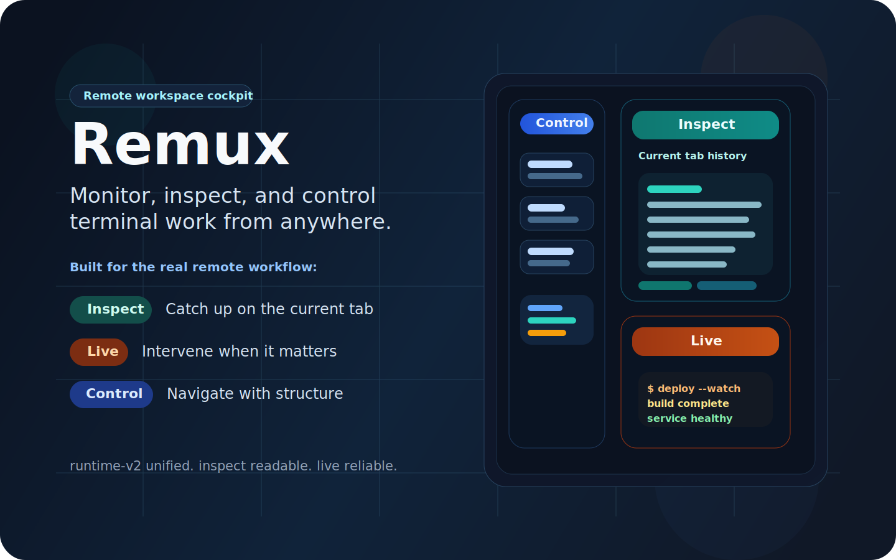
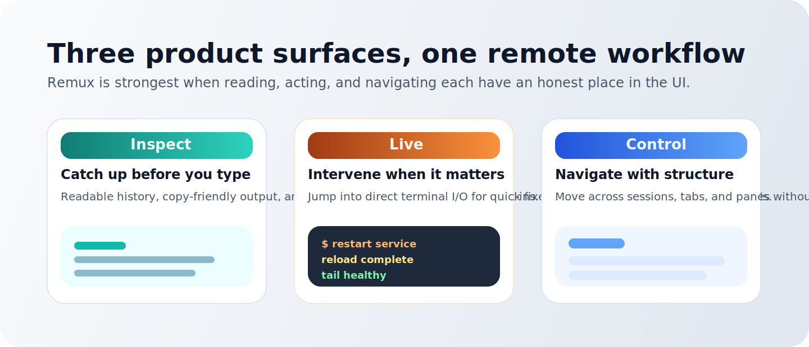

# Remux



**Monitor, inspect, and control live terminal workspaces from a phone, tablet, or second laptop.**

[](https://github.com/yaoshenwang/remux/stargazers)


Remux is a remote workspace cockpit for terminal-first work. It helps you check on long-running coding sessions, AI agents, builds, and shells when you are away from the primary machine. Run `npx remux`, open the generated URL, and move between three complementary surfaces: `Inspect` for readable history and context, `Live` for direct terminal I/O, and `Control` for structured workspace operations.

Remux is intentionally not a generic browser SSH client and not a thin browser wrapper around a multiplexer. It is designed for awareness first, comprehension second, and lightweight intervention when needed.

## Why Remux

- Catch up on the current tab from another device without relying only on the visible terminal viewport
- Read, copy, and inspect terminal history more comfortably on mobile
- Jump into Live only when direct intervention is necessary
- Navigate sessions, tabs, and panes through a structured Control surface
- Browser-based access with no native app install
- Password protection enabled by default, plus optional Cloudflare tunnel exposure
- Separate control and terminal WebSocket channels for structured state sync and terminal streaming

## Product Surfaces



- `Inspect`: readable history and context for catching up, copying, and understanding what happened
- `Live`: direct terminal I/O for quick fixes, command entry, and interactive tools
- `Control`: structured session, tab, and pane navigation plus workspace operations

## Runtime Model

Remux now ships around a unified `runtime-v2` backend.

- `runtime-v2` is now the primary product path, the default browser contract, and the main CI target
- the UI, docs, and test flow are centered on `runtime-v2` semantics rather than backend-specific behavior
- legacy compatibility code still exists temporarily, but it is hidden from the normal product surface and release gate

If you are working on current product behavior, assume `runtime-v2` first.

## Quick Start

### Run from npm

```bash
npx remux
```

Remux prints:

- a local URL
- a tunnel URL when tunnel mode is enabled
- a password when password protection is enabled
- a QR code for quick mobile access

### Run from source

```bash
git clone https://github.com/yaoshenwang/remux.git
cd remux
npm install
npm start
```

## Requirements

- Node.js 20+
- Rust toolchain when running or checking the native `runtime-v2` workspace from source

## Features

- Session, tab, and pane management from the browser control drawer
- Full terminal streaming through xterm.js for Live interaction
- Inspect view for readable history and mobile-friendly text selection
- Server-backed history so Inspect and Live survive browser reconnects with meaningful context intact
- Compose input for native mobile keyboard entry
- Custom snippets stored in local browser storage
- Drag-and-drop or picker-based file upload into the active pane working directory
- Theme picker with six built-in terminal themes
- Automatic reconnect with backoff
- Unified `runtime-v2` gateway model for live state, inspect snapshots, and browser attachment

## CLI

```text
remux [options]

Options:
  -p, --port <port>                Local port (default: 8767)
  --host <host>                    Bind address (default: 127.0.0.1)
  --password <pass>                Authentication password
  --[no-]require-password          Toggle password protection (default: true)
  --[no-]tunnel                    Start Cloudflare quick tunnel (default: true)
  --session <name>                 Default session name (default: main)
  --scrollback <lines>             Default scrollback capture lines (default: 1000)
  --debug-log <path>               Write backend debug logs to a file
```

## Environment Variables

| Variable | Description |
|----------|-------------|
| `REMUX_DEBUG_LOG` | Debug log file path |
| `REMUXD_BIN` | Path to an explicit `remuxd` binary for the runtime-v2 gateway |
| `REMUXD_BASE_URL` | Connect the gateway to an already-running runtime-v2 service |
| `REMUX_VERBOSE_DEBUG=1` | Enable verbose server logging |
| `REMUX_TOKEN` | Reuse a fixed auth token across restarts |
| `VITE_DEV_MODE=1` | Backend knows frontend is served by Vite during development |

## Security Defaults

- Token authentication is always required
- Password protection is enabled by default
- Control and terminal WebSockets authenticate independently
- The server binds to `127.0.0.1` by default
- Tunnel mode uses Cloudflare's HTTPS endpoint instead of exposing the local server directly

Read the full model in [docs/SECURITY.md](./docs/SECURITY.md).

## Documentation

- [docs/TESTING.md](./docs/TESTING.md): current runtime-v2-first test flow and release gate
- [docs/ZELLIJ_BOOTSTRAP.md](./docs/ZELLIJ_BOOTSTRAP.md): short-term Zellij bootstrap path, stable URLs, and launchd commands
- [docs/PRODUCT_ARCHITECTURE.md](./docs/PRODUCT_ARCHITECTURE.md): product definition, interaction model, inspect/history strategy, backend posture, and roadmap
- [docs/SPEC.md](./docs/SPEC.md): current architecture and protocol model
- [docs/SECURITY.md](./docs/SECURITY.md): security assumptions, risks, and operating guidance
- [docs/NATIVE_PLATFORM_ROADMAP_2026-03-26.md](./docs/NATIVE_PLATFORM_ROADMAP_2026-03-26.md): native-client and semantic-adapter evolution plan

## Development

```bash
npm run dev
```

Managed runtime sync for long-running `main` / `dev` instances:

```bash
npm run runtime:install-launchd
npm run runtime:sync
npm run runtime:promote-shared
npm run runtime:status
```

Those public `main` / `dev` gateways are intended to share one machine-level `runtime-v2` daemon, so deploys do not create a fresh private workspace per version. The shared runtime core now lives in its own detached worktree and is only updated by an explicit promote step; normal `dev` syncs only roll the `dev` gateway and auto-rollback if attach healthchecks fail. Shared-core promote now has a protocol compatibility gate against the `main` and `dev` gateway sources, and every promote writes a before/after report under `$HOME/.remux/reports/`.

See [docs/RUNTIME_SYNC.md](./docs/RUNTIME_SYNC.md) for the detached runtime worktree layout and launchd setup.

Self-hosted deploy runner:

```bash
npm run runner:install
npm run runner:status
```

See [docs/SELF_HOSTED_RUNNER.md](./docs/SELF_HOSTED_RUNNER.md) for the deploy workflow and security boundary.

Default pre-merge gate:

```bash
npm run test:gate
```

Additional test commands:

```bash
npm run test:e2e
npm run test:e2e:functional
npm run test:e2e:screenshots
npm run test:release
```

## Tech Stack

- Backend gateway: Node.js, Express 5, `ws`, `yargs`, `zod`
- Native runtime: Rust workspace (`remuxd` and supporting crates)
- Frontend: React 19, Vite, xterm.js
- Testing: Vitest and Playwright
- Language: TypeScript

## Acknowledgments

Remux was originally inspired by existing browser-based terminal access tools and then substantially rewritten around a dedicated mobile-first control surface.

## Contributors

Thanks to everyone who has helped shape Remux.

[](https://github.com/yaoshenwang/remux/graphs/contributors)

Made with [contrib.rocks](https://contrib.rocks).

## Star History

[](https://star-history.com/#yaoshenwang/remux&Date)

## License

MIT. See [LICENSE](./LICENSE).
